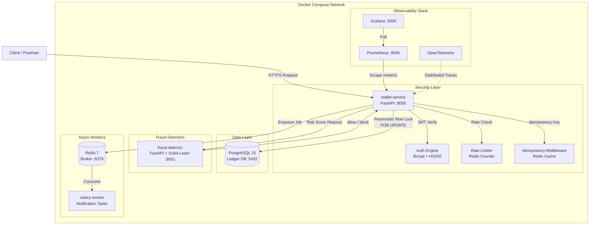
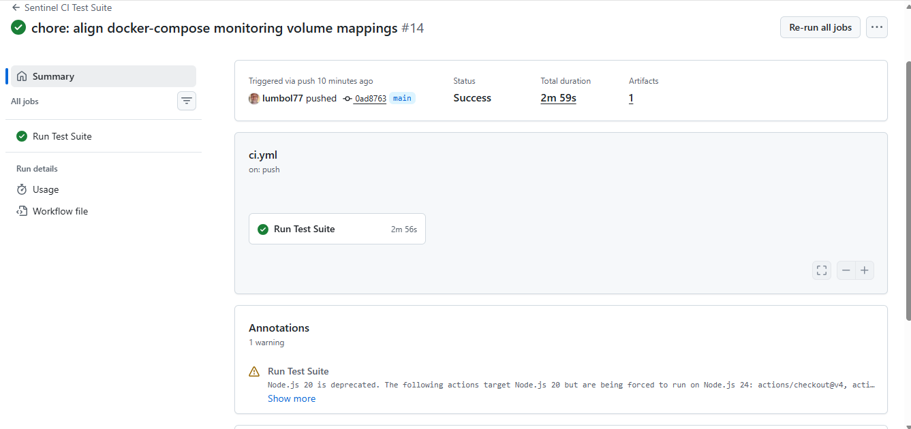
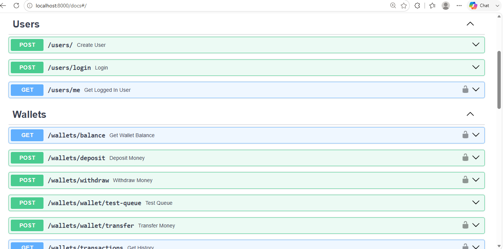
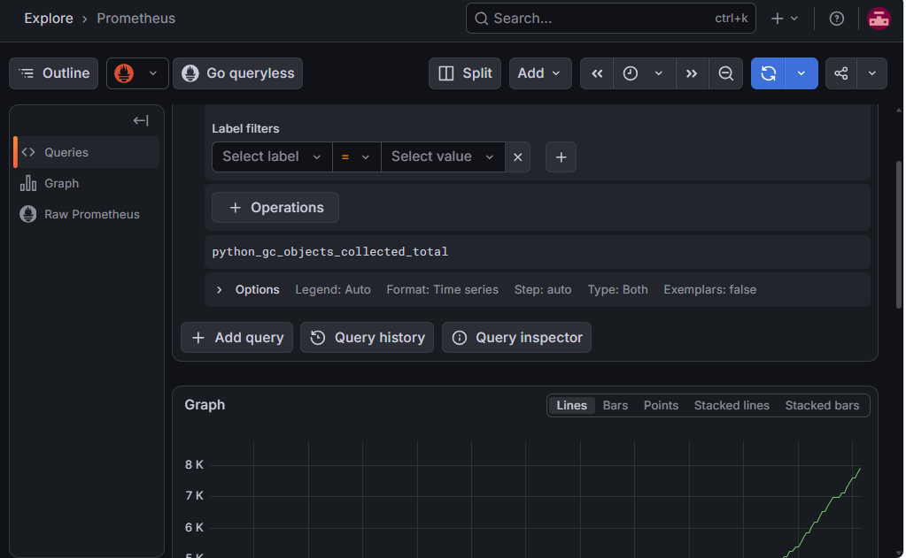

# Sentinel Financial Ecosystem

> A production-grade, distributed fintech backend engineered for high-throughput wallet operations, fraud detection, and real-time observability.

**Mentor Rating: 9.2/10 — Testing Milestone: APPROVED**

---

## What This Is

Sentinel is a microservices fintech backend that handles peer-to-peer wallet transfers with bank-grade integrity guarantees. It is not a tutorial project — it is an engineering case study built to solve real distributed systems problems: race conditions on concurrent balance mutations, duplicate transaction prevention, asynchronous fraud scoring, and full-stack observability across containerized services.

Every design decision maps to a production concern. Every component earns its place.

---

## System Architecture



---

## Services

| Service | Technology | Port | Role |
|---------|-----------|------|------|
| `wallet-service` | FastAPI + Uvicorn | 8000 | Core API — auth, wallets, transfers |
| `fraud-detector` | FastAPI + Scikit-Learn | 8001 | ML risk scoring microservice |
| `celery-worker` | Celery 5 | — | Background task execution |
| `db` | PostgreSQL 15 | 5432 | Relational ledger database |
| `redis` | Redis 7 | 6379 | Cache, idempotency store, Celery broker |
| `prometheus` | Prometheus | 9090 | Metrics collection |
| `grafana` | Grafana | 3000 | Dashboard visualization |

---

## Key Engineering Features

### Pessimistic Row-Level Locking
Concurrent transfers acquire `SELECT FOR UPDATE` locks in deterministic ID order (lower wallet ID first) to prevent deadlocks while guaranteeing atomic balance mutations. No two transfers can modify the same wallet simultaneously.

### Idempotency Middleware
Every mutating request carries an idempotency key checked against Redis before execution. Duplicate network retries return the cached original response — eliminating accidental double-deductions without any client-side coordination.

### Fraud Detection with Fail-Open Resilience
Transfers are scored by a Scikit-Learn ML model before execution. The resilience layer implements three-attempt retry with exponential backoff. If the fraud service is unreachable or returns a malformed response, the system fails open — the transaction proceeds with the event logged — rather than blocking legitimate users on infrastructure failures.

### Asynchronous Notification Pipeline
Post-transfer notifications are enqueued to Redis and consumed by the Celery worker pool. The API response returns immediately — users never wait for email or notification delivery latency.

### Rate Limiting
Per-user rate limiting enforced via Redis counters with sliding window expiry. Transfer endpoints return `429 Too Many Requests` after threshold breach.

### JWT Authentication
Stateless HS256 JWT tokens with configurable expiry. Bcrypt password hashing. OAuth2 password flow compatible with Swagger UI's Authorize button.

### Production Observability
- **OpenTelemetry** — distributed trace export to Tempo (degrades gracefully to no-op if Tempo is offline)
- **Prometheus** — scrapes `/metrics` for request counts, latency histograms, and transaction counters
- **Grafana** — pre-wired to Prometheus for live dashboard visualization
- **Structured logging** — correlation IDs injected per request via context variables

---

## Tech Stack

| Layer | Technology |
|-------|-----------|
| API Framework | FastAPI (Python 3.11) |
| Database | PostgreSQL 15 |
| Cache & Broker | Redis 7 |
| Background Tasks | Celery 5 |
| ML Fraud Scoring | Scikit-Learn |
| Authentication | JWT (python-jose) + Bcrypt (passlib) |
| Observability | OpenTelemetry + Prometheus + Grafana |
| Containerization | Docker + Docker Compose |
| Testing | pytest + pytest-asyncio |

---

## Quickstart

```bash
git clone https://github.com/yourusername/distributed-fintech-core
cd distributed-fintech-core
docker compose up --build
```

| Endpoint | URL |
|----------|-----|
| Swagger UI | http://localhost:8000/docs |
| Prometheus | http://localhost:9090 |
| Grafana | http://localhost:3000 |
| Fraud API | http://localhost:8001/docs |

---

## Environment Variables

Create a `.env` file in the project root:

```env
SECRET_KEY=your-secret-key-here
ALGORITHM=HS256
ACCESS_TOKEN_EXPIRE_MINUTES=60
DATABASE_URL=postgresql://postgres:password@db:5432/fintech
REDIS_URL=redis://redis:6379/0
```

---

## API Reference

### Authentication
| Method | Endpoint | Description |
|--------|----------|-------------|
| `POST` | `/users/` | Register new user + wallet |
| `POST` | `/users/login` | Login, receive JWT |
| `GET` | `/users/me` | Get current user profile |

### Wallet Operations
| Method | Endpoint | Description |
|--------|----------|-------------|
| `GET` | `/wallets/balance` | Get wallet balance |
| `POST` | `/wallets/deposit` | Deposit funds |
| `POST` | `/wallets/withdraw` | Withdraw funds |
| `POST` | `/wallets/wallet/transfer` | Transfer to another user |
| `GET` | `/wallets/transactions` | Transaction history |

### System
| Method | Endpoint | Description |
|--------|----------|-------------|
| `GET` | `/health` | Liveness probe |
| `GET` | `/metrics` | Prometheus scrape endpoint |

---

## Automated Test Suite

49 tests across 5 modules covering all critical paths.

```
docker exec wallet_api python -m pytest app/tests/ -v
```

```
============ 49 passed, 6 skipped in 119.63s =============
```

| Module | Tests | Coverage |
|--------|-------|----------|
| `test_auth.py` | 13 | Registration, login, JWT validation, protected routes |
| `test_wallet.py` | 13 | Balance, deposit, withdrawal, auth enforcement |
| `test_transfer.py` | 13 | P2P transfer, balance mutations, fraud block, history |
| `test_fraud.py` | 11 | API contract, fail-open resilience, service unavailability |
| `test_rate_limiting.py` | 5 | Counter logic, 429 enforcement, Redis mock |

**Bugs found and fixed by the test suite:**
- `models.wallet` → `models.Wallet` casing error in transaction service
- `get_transactions` contained transfer logic instead of query logic
- `ValueError` from insufficient funds not caught by endpoint (500 → 400)
- `/me` endpoint calling `get_current_user` with wrong argument type

---

## Project Structure

```
distributed-fintech-core/
├── app/
│   ├── api/endpoints/          # Route handlers
│   │   ├── users.py            # Auth endpoints
│   │   └── wallet.py           # Wallet endpoints
│   ├── core/                   # Application core
│   │   ├── celery_app.py       # Celery configuration
│   │   ├── tasks.py            # Background task definitions
│   │   ├── rate_limiter.py     # Redis rate limiting
│   │   └── metrics.py          # Prometheus counters
│   ├── crud/                   # Database operations
│   │   └── wallet_crud.py      # Wallet CRUD + transfer logic
│   ├── middleware/
│   │   ├── idempotency.py      # Duplicate request prevention
│   │   └── tracing.py          # OpenTelemetry setup
│   ├── services/
│   │   ├── transaction_service.py  # Transfer orchestration + fraud check
│   │   └── wallet_service.py       # Deposit/withdraw business logic
│   ├── tests/
│   │   ├── test_auth.py
│   │   ├── test_wallet.py
│   │   ├── test_transfer.py
│   │   ├── test_fraud.py
│   │   └── test_rate_limiting.py
│   ├── main.py                 # FastAPI app + lifespan
│   ├── models.py               # SQLAlchemy ORM models
│   ├── schemas.py              # Pydantic request/response schemas
│   ├── security.py             # JWT + auth utilities
│   └── database.py             # DB engine + session factory
├── FRAUD_DETECTION_API/        # Standalone fraud microservice
│   ├── app/main.py
│   ├── model/
│   │   ├── fraud_model.pkl
│   │   └── scaler.pkl
│   └── train.py
├── monitoring/
│   └── prometheus.yml
├── docker-compose.yml
├── dockerfile
├── requirements.txt
└── .env
```

## Automated CI/CD Pipeline



## API Documentation (Swagger UI)



## Infrastructure Observability (Grafana Dashboard)



---

## What I Learned Building This

This project was built to prove that engineering ability is not determined by degree classification.

The problems solved here — distributed locking, idempotency, async task queues, ML microservice integration, resilience patterns, observability — are the same problems that appear in production fintech systems at scale.

The test suite found and fixed four production bugs during development. That is the point of testing.

---

## Author

**Lawrence**  
Backend Engineer  
[GitHub](https://github.com/lumbol77) · [LinkedIn](https://linkedin.com/in/yourprofile)
